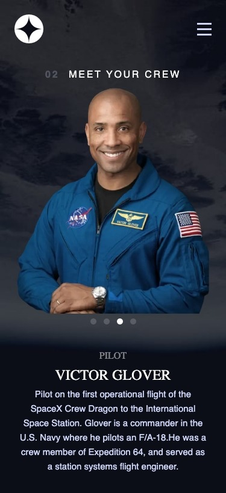
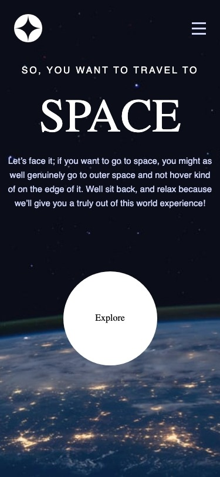

# Frontend Mentor - Space tourism website solution  <!-- omit in toc -->

The project you are about to explore is a solution to the Space Tourism website challenge on Frontend Mentor.

Frontend Mentor is a platform that provides realistic projects aimed at improving coding skills. Each challenge pushes you to level up your skills and deliver the best possible solution. This space tourism website is one such challenge that tested my capabilities and skills.

This was my first attempt at building a multi-page site and despite the hurdles and learning curves, the experience was rewarding. During the development process, I was introduced to new concepts and strategies that played a significant role in my growth as a developer.

## Table of contents <!-- omit in toc -->

- [Overview](#overview)
  - [The challenge](#the-challenge)
  - [Screenshot](#screenshot)
  - [Links](#links)
- [My process](#my-process)
  - [Built with](#built-with)
  - [What I learned](#what-i-learned)
  - [Continued development](#continued-development)
  - [Useful resources](#useful-resources)
- [Author](#author)

**Note: Delete this note and update the table of contents based on what sections you keep.**

## Overview

### The challenge

This project, as mentioned earlier, is a solution to the Space tourism website challenge on Frontend Mentor. The challenge is aimed to help developers improve their coding skills by building realistic projects.

As a first multi-page website, it was a significant challenge that tested and expanded my skills. The journey was not a smooth one. It pushed me to my limits and nudged me to step out of my comfort zone. It took some getting used to as I had to adapt to a new mindset of dealing with multiple pages, which I hadn't done before.

Through this challenge, I gained a deeper understanding of the working and structuring of multi-page sites. It was a transformative learning experience that has set a new standard for my future projects.

### Screenshot

In the screenshot above, you can see the final result of my space tourism website project. The website is a multi-page site with a user-friendly interface and vibrant visuals that encapsulate the essence of space exploration. The pages are neatly structured, with each page providing relevant and interesting information about space tourism.

### Links

- Solution URL: [View solution URL here](https://www.frontendmentor.io/challenges/space-tourism-multipage-website-gRWj1URZ3/hub)
- Live Site URL: [View live site URL here](https://space-tourism-react-fem.vercel.app/)

## My process

### Built with

Throughout this project, I implemented and used a variety of different technologies that helped bring the project to life:

- React: This project was my maiden venture into using React. It was a learning experience, getting to know how to handle components and states within React.

- CSS Modules: For managing the background images and setting up grid areas for the layout, I used CSS modules. It made managing layout shifts for different devices much more manageable.

- Framer Motion: To add some flair to the project, I implemented animations using Framer Motion.

- Tailwind CSS: For most of the project, I utilized Tailwind CSS for its simplicity and intuitive design. However, I found that as things got more complex, like for my grid layouts, I needed to move beyond Tailwind for my grid-template-areas.

Each of these tools brought its own strengths to the project, and I learned a lot about when and how to use them effectively.

**Note: These are just examples. Delete this note and replace the list above with your own choices**

### What I learned

This project was a profound learning experience for me. Being my first multi-page site, it introduced me to new concepts and challenged my existing skills.

- React: Working with React was both challenging and rewarding. There was a steep learning curve but once I started to understand the concept of components and states, it became an exciting journey.

- Structuring Files and Components: One of the struggles I faced was figuring out how to structure my files and components. It was a new concept for me, but as I navigated through the project, I began to understand the significance and efficiency of componentization.

- Managing Background Images: Ensuring high quality of the background images while being responsive was a challenging task. I had to try different methods and finally landed on using CSS modules, which ended up being very effective.

- Managing Active Page in Navigation: Figuring out how to get the paths for each page to pass down to the nav to show which page is active was a unique challenge. It was particularly tricky when a user directly navigates to a page.

This project was indeed a journey of discovery and learning. The complexities I faced helped me grow as a developer and made me more confident in tackling new challenges.

### Continued development

Moving forward, I am aware there's a lot more to learn and refine. The completion of this project has not only given me a sense of accomplishment but also an array of learning avenues to explore further.

- More React: I plan to continue honing my skills in React. With this project, I've just scraped the surface of what this powerful library can do, and I'm excited to delve deeper.

- Refining Project Structure: Although I've made strides in understanding how to structure my files and components, I believe there's room for improvement. I aim to learn more about best practices and efficient ways to structure larger projects.

- CSS Modules and Media Queries: The use of CSS modules and managing background images was a highlight of this project. I intend to experiment more with these in future projects to ensure seamless responsiveness and high-quality imagery.

- Active Navigation State: Getting the active state in navigation right was a new challenge for me. In future projects, I aim to refine this process further and make it more efficient.

- Feedback and Collaboration: This project was a solo endeavor. Going forward, I am keen to collaborate with other developers and receive feedback on my work. Constructive criticism is a great way to learn, and I am open to any thoughts or opinions from others.

My journey as a developer is ongoing, and with every new project, I aim to push my boundaries, learn new things, and improve on the existing skills. I am confident that with practice, I will grasp these concepts faster and better.

### Useful resources

Here are some key resources that played a vital role in the completion of this project:

- [React Documentation](https://react.dev/learn) - The official React documentation was indispensable for getting to grips with React's concepts and understanding how to work with it effectively.

- [NextJS Documentation](https://nextjs.org/docs) - NextJS documentation was an excellent resource for understanding the principles and benefits of a hybrid static and server rendering.

- [Tailwind CSS Documentation](https://tailwindcss.com/docs/installation) - Tailwind's documentation was vital in figuring out how to use their utility-first classes to style my project efficiently.

- [MDN Web Docs](https://developer.mozilla.org/en-US/) - MDN Web Docs is always a go-to resource for understanding web technologies. It was incredibly helpful for getting a firm grasp on concepts like CSS modules and more.

- [WebDevSimplified's YouTube Channel](https://www.youtube.com/c/webdevsimplified) - This YouTube channel was a great source of practical examples and clear, concise explanations of web development concepts.

- [Kevin Powell's YouTube Channel](https://www.youtube.com/channel/UCJZv4d5rbIKd4QHMPkcABCw) - Kevin's channel offered a wealth of knowledge, especially in terms of CSS. His clear and in-depth explanations are a fantastic resource for any developer.

These resources were instrumental in my journey through this project, and I recommend them to anyone who wishes to learn these concepts.

## Author

- Github - [@blazeshomida](https://github.com/blazeshomida)
- Frontend Mentor - [@shomidamoney](https://www.frontendmentor.io/profile/shomidamoney)

# Space-Tourism-Website-React-FEM
